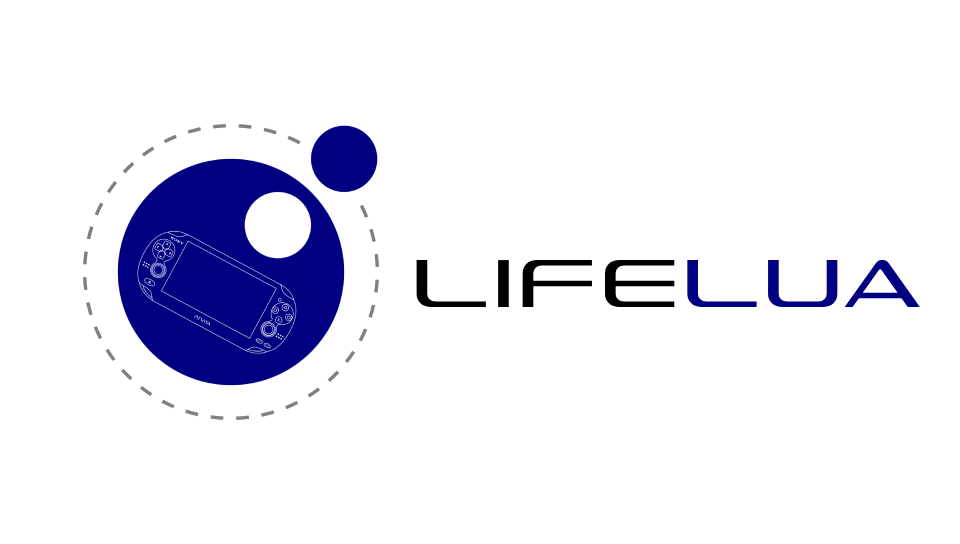

# LifeLua
LifeLua is a Lua interpreter for the PS Vita which combines simplicity with advanceability. It is an alternative to the other Lua interpreters available for the platform.

</img>

## Features
* Timers with pausing and stopping
* Camera support with effects and filters
* JSON, TOML and SQLite3 support
* Image support including PSD, TGA & HDR support
* Audio with support for MP3, WAV, OGG, OPUS, FLAC and tracker module formats (.MOD, .IT & more)
* QR code scanning & generation
* Shapes with solid colors or gradients
* TBA
## Documentation
https://harommelrabbid.github.io/LifeLua
## Samples
For a showcase of LifeLua's features go to the repository's `sample` folder.
## Compiling
* [libsqlite](https://github.com/VitaSmith/libsqlite): run `cd libsqlite && make`, move the library (ends with` *.a`) in the folder where the libraries are stored in the vitasdk, and run `make install`, see https://github.com/VitaSmith/libsqlite?tab=readme-ov-file#compiling
* Set up [vitasdk](https://github.com/vitasdk) if you haven't and build LifeLua using:

```
mkdir build && cd build && cmake .. && make
```

To make after your first build (assuming you are in the `build` folder):

```
find . -mindepth 1 -delete && cmake .. && make
```

## To do
* Rewrite the audio library with a new backend
* libmpv video support, so that video streaming will work and also support for 1080p video quality
* Audio streaming support
* 3D support with shading, shadows & reflections
* More shape drawing functions, such as drawing arches
* Adhoc & socket support, and maybe PSN support as well
* SHA512 & Base64 decoding/encoding support
* Fix the thread library (it's kind of unstable, some functions as a thread may crash the app, depending on how heavy the function is)
* Channels for communicating between threads (like in LÖVE2D)
* USB support (maybe)
* Update utf8 library
* Add MessagePack support
* Get & set pixel of an image
* libime support (half-screen keyboard)
* Syntax extensions that were recently added to LuaJIT
## Credits
* TheFloW's VitaShell for video and image exporting
* [quirc-vita](https://github.com/cxziaho/quirc-vita) by [cxziaho](https://github.com/cxziaho)
* [QR-Code-generator](https://github.com/nayuki/QR-Code-generator) by [nayuki](https://github.com/nayuki)
* libvita2d & ftpvita by xerpi
* Inspiration from [Lua Player Plus Vita](https://github.com/Rinnegatamante/lpp-vita) by [Rinnegatamante](https://github.com/Rinnegatamante)
* [luautf8](https://github.com/starwing/luautf8) by [starwing](https://github.com/starwing)
<!--
* [Compound Assignment Operators](http://lua-users.org/files/wiki_insecure/power_patches/5.2/compound-5.2.2.patch) (Lua diff patch) by [SvenOlsen](http://lua-users.org/wiki/SvenOlsen)
* [Bitwise operators, integer division and !=](http://lua-users.org/files/wiki_insecure/power_patches/5.1/bitwise_operators_5.1.4_1.patch) by Thierry Grellier, darkmist(at)mail.ru & Joshua Simmons
* [Continue Statement](https://lua-users.org/files/wiki_insecure/power_patches/5.1/continue-5.1.3.patch) by Leszek Buczkowski, Wolfgang Oertl & [AskoKauppi](https://lua-users.org/wiki/AskoKauppi)
-->
